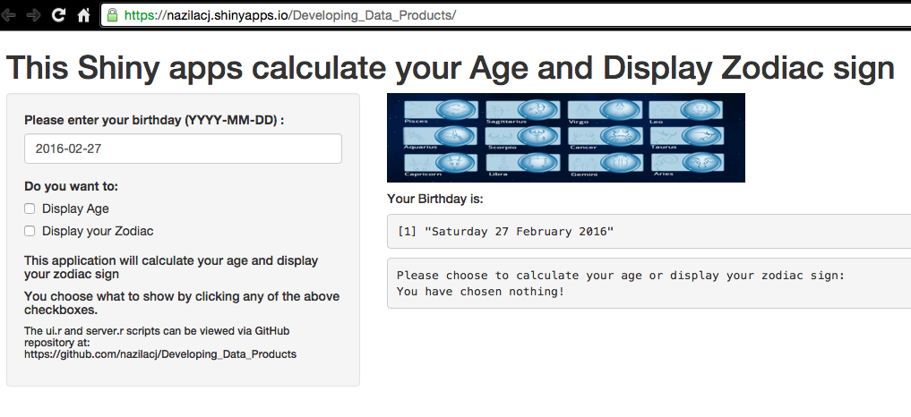
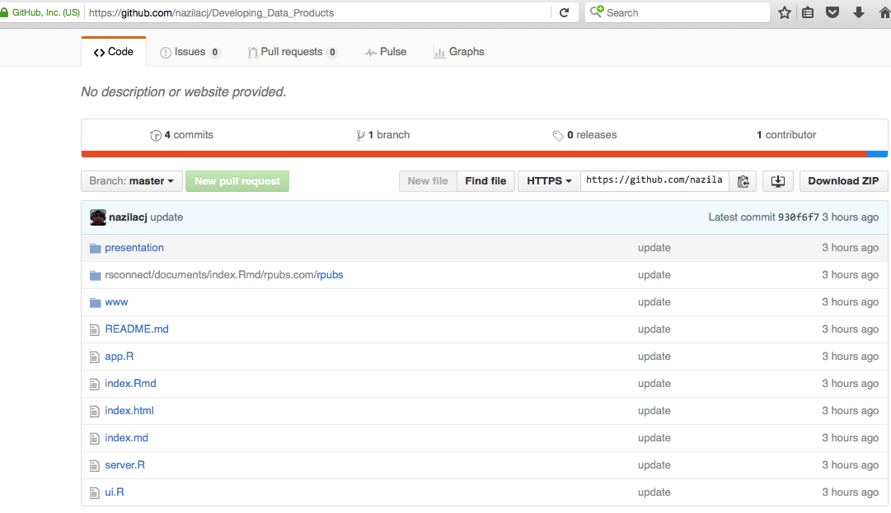

Developing Data Products
========================================================
title: 'Module 9: Developing Data Product'
author: Nazila Che Jaafar
date: February 27, 2016

Introduction to the apps
========================================================

The shiny apps will calculate your Age and display Zodiac sign . Through the input of birthday (YYYY-MM-DD), it uses the date time conversion and rounding of numbers functions to calculate your current Age. You just need to click on the 'Display Age' or 'Display your Zodiac' buttons and the program will return what you desired.

Shiny Apps
========================================================

The shiny apps can be viewed at this page 
https://nazilacj.shinyapps.io/Developing_Data_Products

Github Repo
========================================================

The code for the shiny apps can be downloaded from the github repo at https://github.com/nazilacj/Developing_Data_Products.

Code Reproducibility
========================================================

This repo contains all the code and data making up this solution. The files and folders are the following:

- README.md
- app.R, ui.R and server.R - The shiny app code
- /presentation - The R Markdown used to create the RStudio Presenter presentation.

